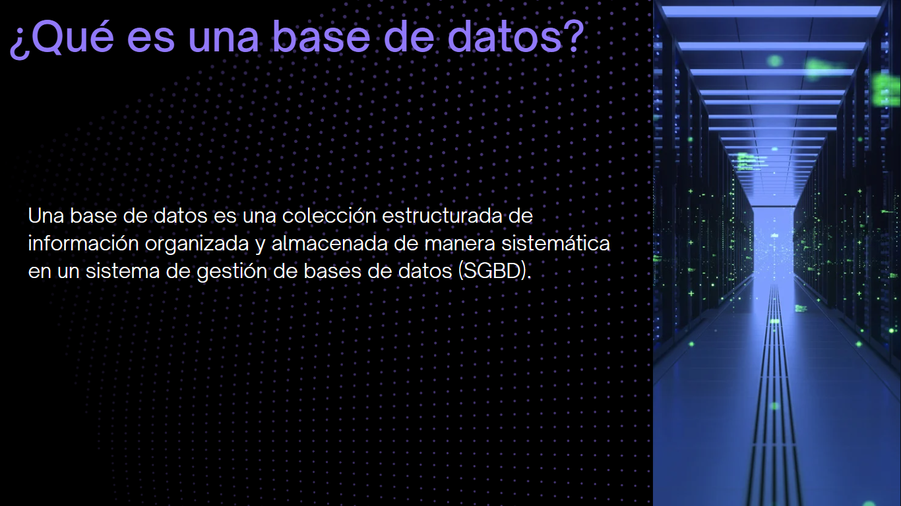

# SQL De cero a Experto - PostgreSQL
Este repositorio hace un seguimiento del curso en DevTalles SQL Cero a Experto con PostgreSQL impartido por Fernando Herrera 

Pasos para levantar el proyecto  
Tener docker Desktop o el demonio de Docker corriendo  
Clonar el proyecto  
Navegar a la carpeta del proyecto  
Ejecutar docker compose up -d  
Revisar el archivo docker-compose.yml para los usuarios y contraseñas 

  
  
  
  
  
  